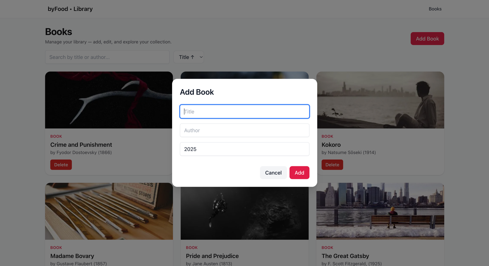
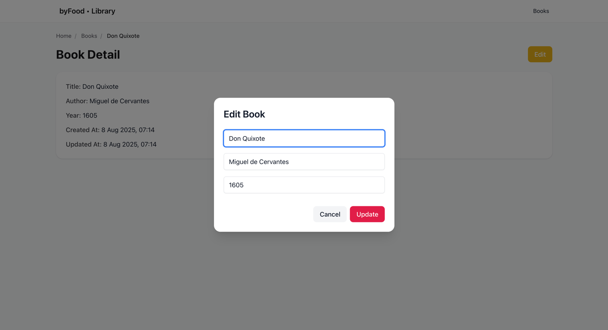
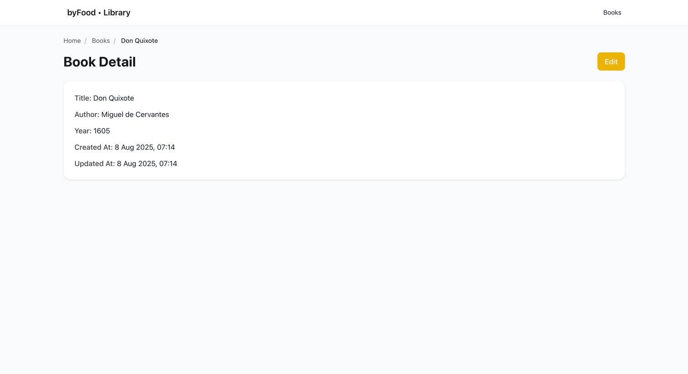
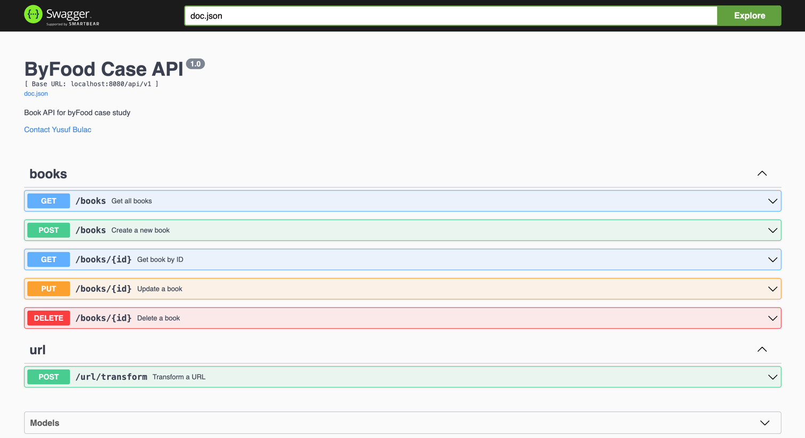

# ByFood Case – Full-Stack Monorepo

This repository contains a **full‑stack implementation** of the ByFood case study:
- **Frontend:** Next.js 15 (App Router) + React 19 + TypeScript + Tailwind CSS
- **Backend:** Go (Fiber) + GORM (MySQL) + Swagger
- **Tooling:** Docker & Docker Compose, structured logging (Zap), validation, unit & handler tests

---

## Monorepo Layout

```
byfood-case/
├── backend/              # Go / Fiber API (CRUD + URL transform service)
├── frontend/             # Next.js app (SSR list/detail, client modals, Context for search/sort)
├── docker-compose.yml    # MySQL + Backend (+ optional Frontend)
└── README.md             # project overview
```

---

## Tech Stack

**Frontend**
- Next.js **15** (App Router), React **19**, TypeScript
- Tailwind CSS
- Context API for shared UI state (search & sort)
- Server Components for data pages; Client Components for modals/actions
- Toast notifications, loading and error boundaries

**Backend**
- Go **1.24**, Fiber, GORM (MySQL)
- go-playground/validator for DTO validation
- Zap for structured logs + request logging middleware
- Swagger docs (`/swagger/index.html`)
- Tests: service unit tests + API handler tests (request/response bodies)

---

## Environment Variables

### Backend (`backend/.env` for local development)
```
APP_PORT=8080
DB_HOST=localhost
DB_PORT=3306
DB_USER=byfood_user
DB_PASSWORD=byfood_pass
DB_NAME=byfood
```

> With Docker Compose, use `backend/.env.docker` where `DB_HOST=byfood-mysql`.

### Frontend (`frontend/.env.local`)
```
NEXT_PUBLIC_API_BASE_URL=http://localhost:8080
```
> When running via Compose with a frontend service, set: `http://byfood-backend:8080`.

---

## Run with Docker Compose

> The provided compose file includes MySQL and Backend. If you also add the frontend service, all three can run together.

```bash
# from repository root
docker compose up --build
```

- Backend: http://localhost:8080
- Swagger: http://localhost:8080/swagger/index.html
- MySQL: localhost:3306 (byfood / byfood_user)
- Frontend (if enabled): http://localhost:3000

---

## Local Development (without Docker)

### Backend
```bash
cd backend
go mod tidy
go run cmd/app/main.go
# http://localhost:8080
```

### Frontend
```bash
cd frontend
npm install
npm run dev
# http://localhost:3000
```

---

## API Endpoints (v1)

**Books**
- `GET    /api/v1/books` — list
- `POST   /api/v1/books` — create
- `GET    /api/v1/books/{id}` — detail
- `PUT    /api/v1/books/{id}` — update
- `DELETE /api/v1/books/{id}` — delete

**URL Transform**
- `POST /api/v1/url/transform`
  **Request**
  ```json
  { "url": "https://BYFOOD.com/food-EXPeriences?query=abc/", "operation": "all" }
  ```
  **Response**
  ```json
  { "processed_url": "https://www.byfood.com/food-experiences" }
  ```

---

## Tests

### Backend
```bash
cd backend
go test ./... -v
# only handler tests:
go test ./internal/handler -v
```

### Frontend
```bash
cd frontend
npm run typecheck
npm run lint:fix
```

---

## Screenshots (placeholders)

> Save your screenshots at the following paths and they will be rendered automatically in this README.

### Frontend

**Home / List**


**Add Book Modal**


**Edit Book Modal**


**Book Detail Page**


### Backend / Swagger

**Swagger UI – Books**


---

## Architecture Notes

- **Backend:** Layered architecture (handler → service → repository) with centralized validation and error handling.
- **Frontend:** Server Components for data pages; Client Components for modals and actions. After mutations, `router.refresh()` re‑fetches the SSR list. Context is used for cross‑component UI state (search & sort).
- **DX:** TypeScript + ESLint strict, clear commit history, Dockerfiles & Compose.
- **Docs:** Swagger annotations kept in handlers; generated files stored in `docs/`.

---

## Author

**Yusuf Bulaç** — Software Developer
